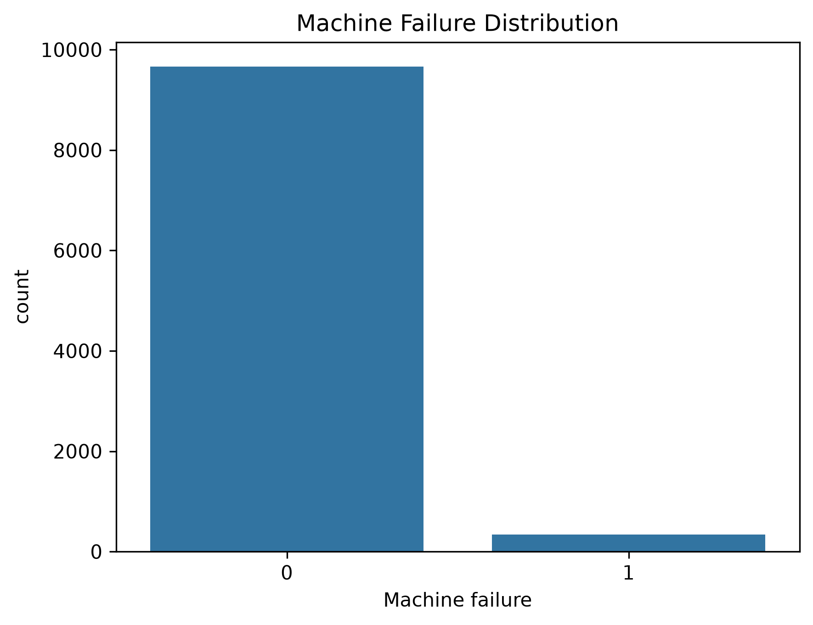
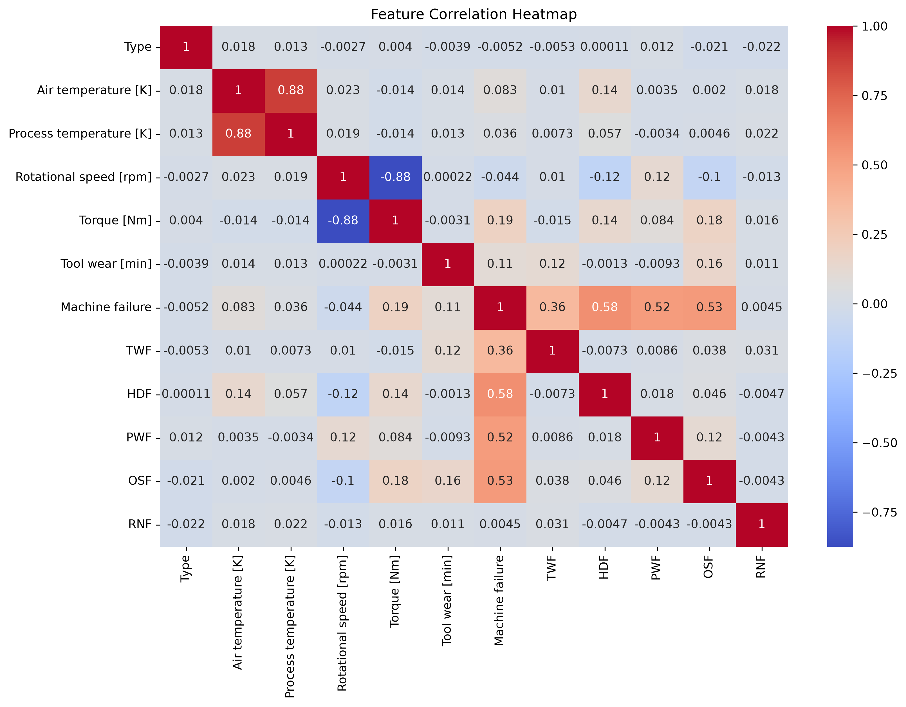
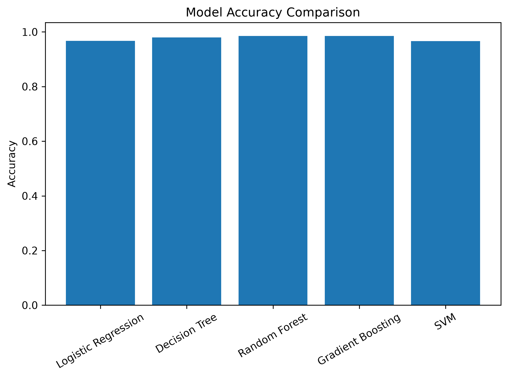
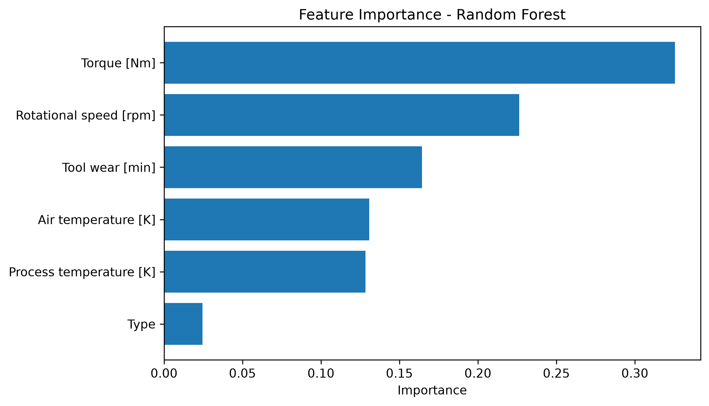
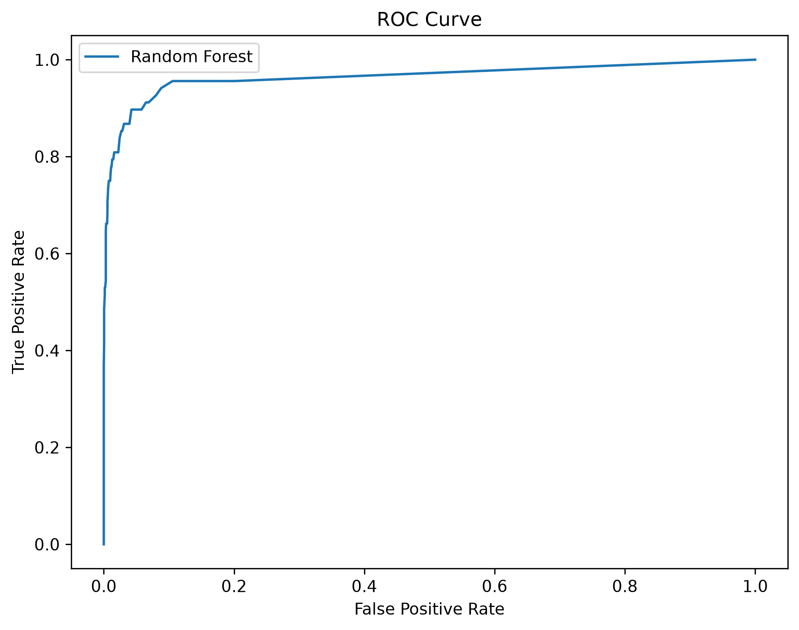
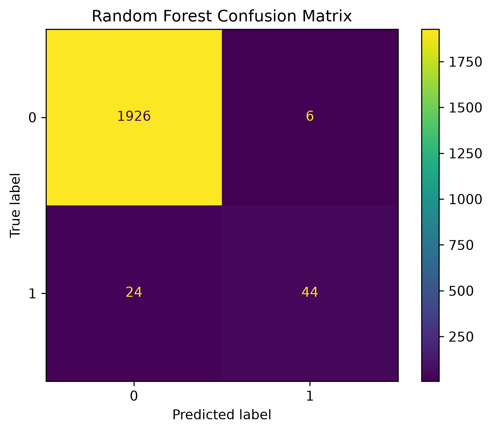

# Machine Failure Prediction Using Machine Learning

## Project Overview

This project predicts machine failures using Machine Learning techniques on the AI4I 2020 Predictive Maintenance Dataset.

The objective is to identify whether a machine is likely to fail based on its operating conditions.

---

## Dataset

Dataset: AI4I 2020 Predictive Maintenance Dataset

Number of Records: 10,000

Target Variable:

- Machine Failure
  - 0 = Normal
  - 1 = Failure

---

## Features Used

- Type
- Air Temperature (K)
- Process Temperature (K)
- Rotational Speed (RPM)
- Torque (Nm)
- Tool Wear (Minutes)

---

## Data Preprocessing

- Removed unnecessary columns
- Label Encoding
- Missing Value Analysis
- Feature Selection

---

## Exploratory Data Analysis

Performed:

- Machine Failure Distribution
- Correlation Heatmap

---

## Machine Learning Models

The following models were trained and evaluated:

- Logistic Regression
- Decision Tree
- Random Forest
- Support Vector Machine (SVM)
- Gradient Boosting

---

## Model Evaluation

Evaluation Metrics:

- Accuracy
- Classification Report
- Confusion Matrix
- ROC Curve
- AUC Score
- Feature Importance
- Cross Validation

---

## Hyperparameter Tuning

GridSearchCV was used to optimize the Random Forest model.

Best Parameters:

- n_estimators = 100
- max_depth = 15
- min_samples_split = 2

---

## Final Model Performance

Best Model:

Random Forest Classifier

Testing Accuracy:

98.5%

---

## Project Structure

```
Predictive_Maintenance_Project/
│
├── outputs/
│   ├── confusion_matrix.png
│   ├── correlation_heatmap.png
│   ├── feature_importance.png
│   ├── machine_failure_distribution.png
│   ├── model_accuracy_comparison.png
│   └── roc_curve.png
│
├── ai4i2020.csv
├── main.py
├── model.pkl
├── requirements.txt
└── README.md
```

---

## Technologies Used

- Python
- Pandas
- NumPy
- Scikit-learn
- Matplotlib
- Seaborn
- Joblib

---

## Outputs

### Machine Failure Distribution



---

### Correlation Heatmap



---

### Model Accuracy Comparison



---

### Feature Importance



---

### ROC Curve



---

### Confusion Matrix



---

## Author

Narmatha

B.Sc Computer Science (Artificial Intelligence & Data Science)

Interested in

- Artificial Intelligence
- Machine Learning
- Data Science
- Python Development